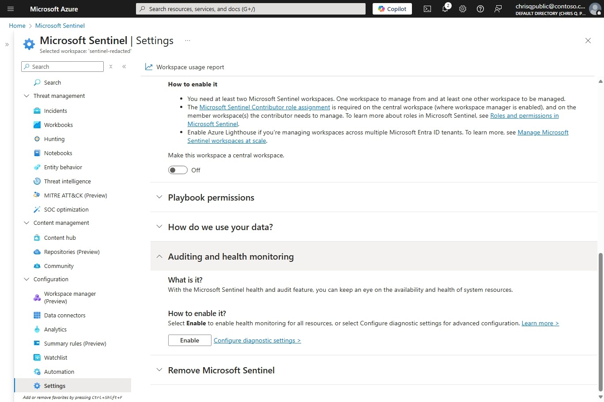
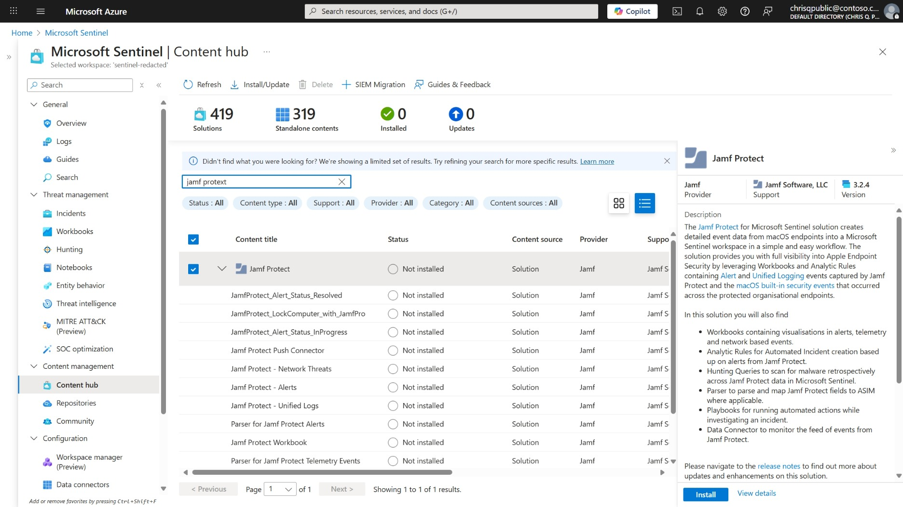
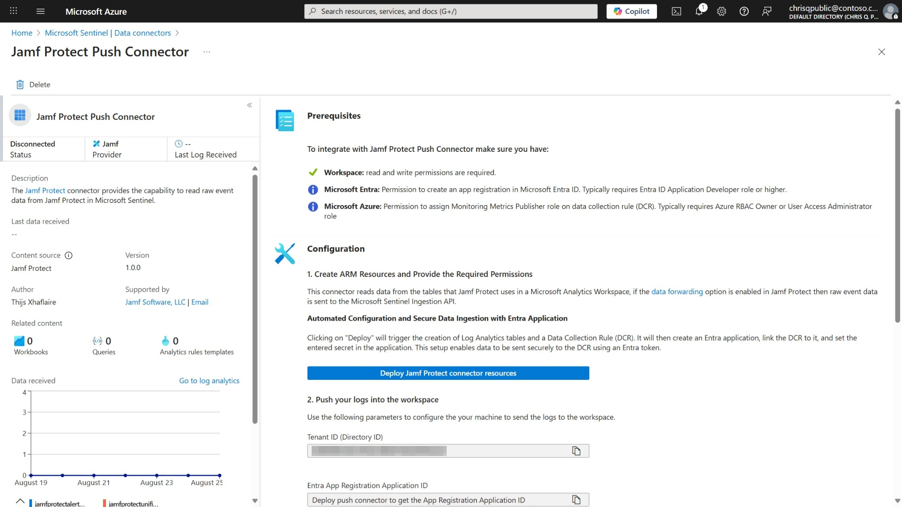
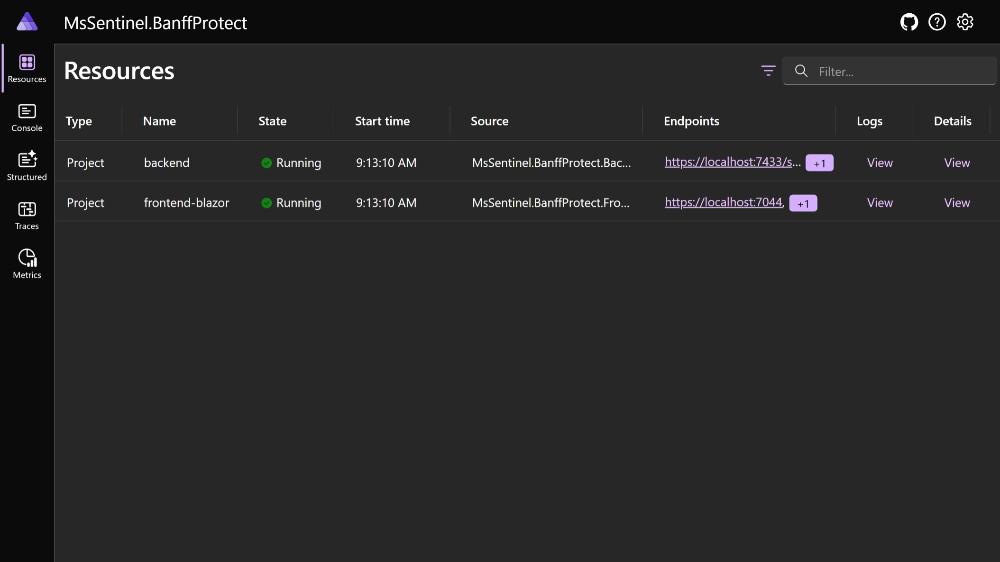
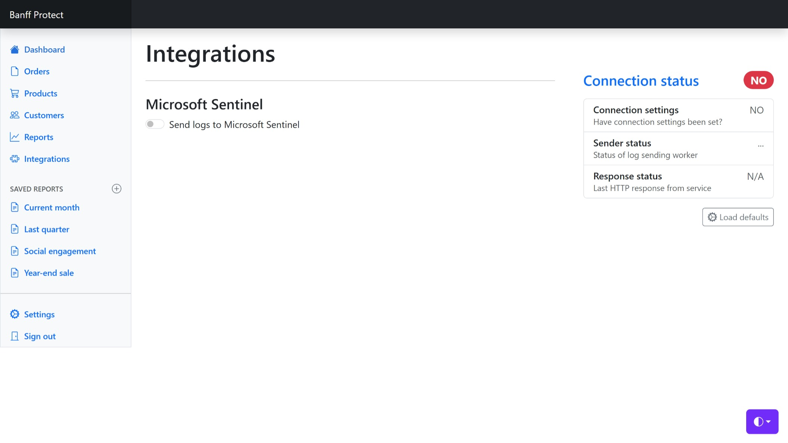
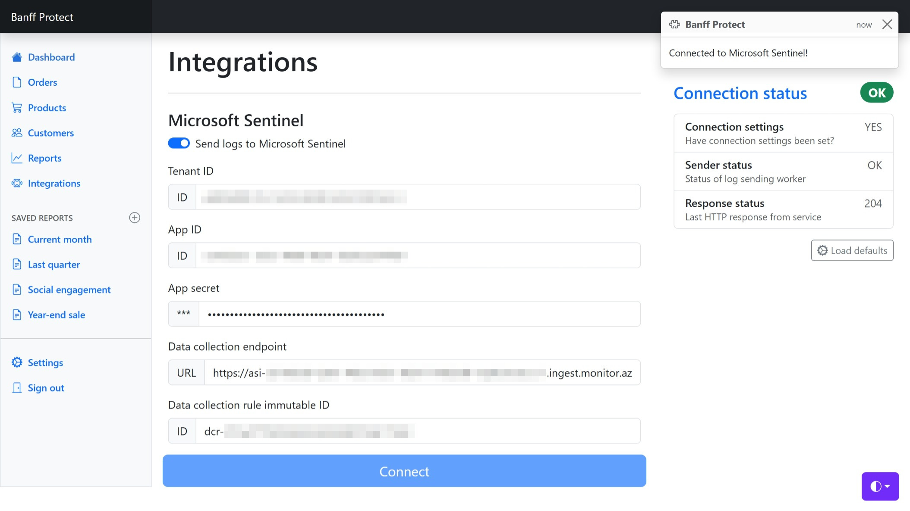
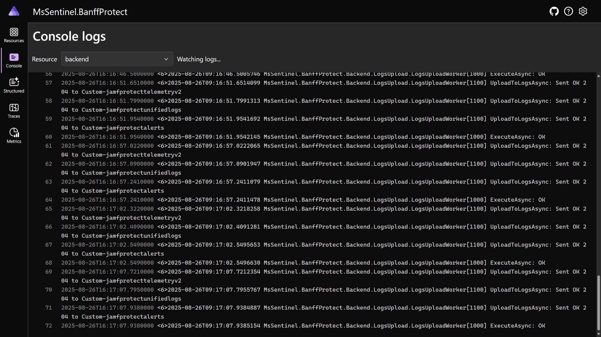
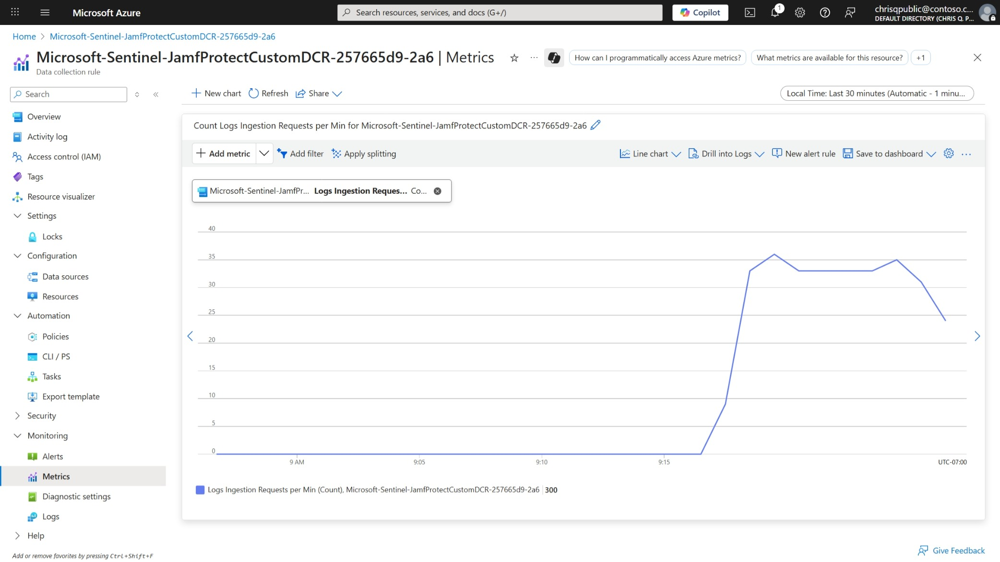
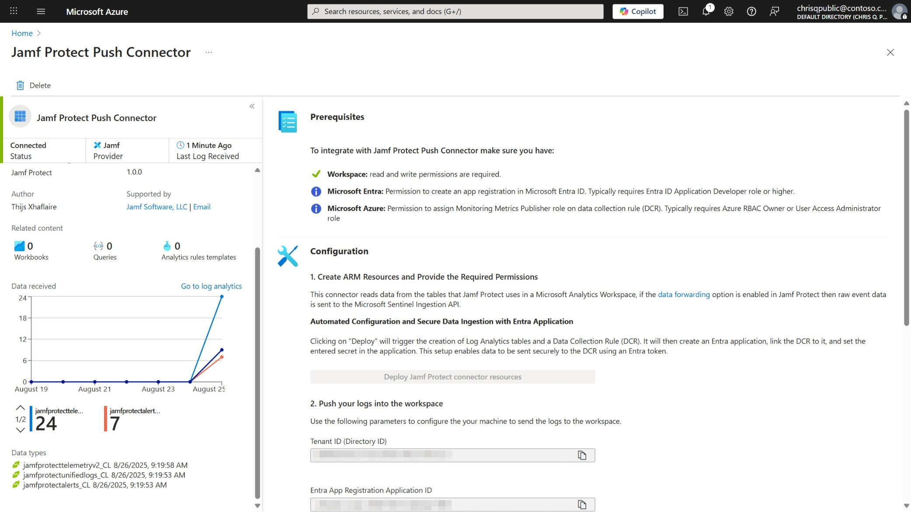
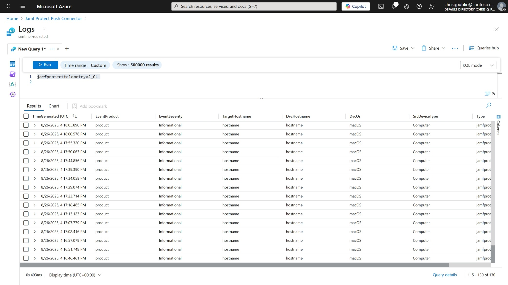

# MsSentinel.BanffProtect Demo

[](https://github.com/jcoliz/MsSentinel.BanffProtect/actions/workflows/build+test.yaml)

This demo mocks the Jamf Protect admin console, demonstrating how to set up the Jamf Protect connector in Microsoft Sentinel.

## Prerequisites

To bring up this demo, you will first need:

* An Azure account. Set up a [Free Azure Account](https://azure.microsoft.com/en-us/pricing/purchase-options/azure-account) to get started.
* [Azure CLI tool with Bicep](https://learn.microsoft.com/en-us/azure/azure-resource-manager/bicep/install#azure-cli)
* A git client, e.g. [Git for Windows](https://gitforwindows.org/)
* Execution policy configured to run unsigned PowerShell scripts, see [About Execution Policies](https://learn.microsoft.com/en-us/powershell/module/microsoft.powershell.core/about/about_execution_policies)
* [.NET 8.0](https://dotnet.microsoft.com/en-us/download/dotnet/8.0) or [.NET 9.0](https://dotnet.microsoft.com/en-us/download/dotnet/9.0) SDK
* [.NET Aspire Workload](https://learn.microsoft.com/en-us/dotnet/aspire/fundamentals/setup-tooling?tabs=windows&pivots=vscode). Note that no container runtime is needed for this demo.

Please refer to the [Tech Check Guide](./docs/Tech-Check.md) for step-by-step instructions to ensure you're ready to continue with the demo.

## Setup

Please complete the following steps to get started.

### 1. Clone this repo

Clone this repo with submodules so you have the [AzDeploy.Bicep](https://github.com/jcoliz/AzDeploy.Bicep) project handy with the necessary module templates.

1. Launch VS Code
1. Hit [F1], and then type "git clone"
1. Pick the option "Git clone (Recursive)". Be sure to get the "recursive" choice.
1. Enter "https://github.com/jcoliz/MsSentinel.BanffProtect"
1. Choose a location to clone into, e.g. "C:\Source"
1. When prompted to "Open cloned repository?", select "OK" or "Open"

### 2. Log into Azure

In a terminal window, ensure you are logged into Azure

```dotnetcli
az login
```

Then verify that the subscription you're logged into is where you want to deploy. Make adjustments as needed.

```dotnetcli
az account show
```

## Provision Azure resources

For this demo, it's helpful to have a dedicated Sentinel Workspace. To provision a dedicated workspace, run the [Provision-Resources.ps1](./infro/Provision-Resources.ps1) script. Supply a memorable environment name and Azure datacenter location according to your preference. These instructions imagine you've used `banff-protect` for this. If you've chosen something different, be sure to
use the correct moniker where needed.

```dotnetcli
.\infra\Provision-Resources.ps1 -EnvironmentName banff-protect -Location westus
```

When this script completes, it will pass along some helpful information:

```dotnetcli
Deployed sentinel workspace sentinel-something

When finished, run:
az group delete --name rg-banff-protect
```

## Enable Sentinel Health monitoring



Always ensure that health monitoring is enabled on any Sentinel workspace before doing _anything_ in it.

1. Begin in the Azure Portal
1. Choose the "Microsoft Sentinel" service.
1. Click on the name of the resource we deployed above. See the provisioning script output for its name.
1. Click Settings > Settings
1. Expand the Auditing and Health Monitoring section
1. Click the "Enable" button

## Install Jamf Protect solution from Content Hub



For our use today, we'll install the "Jamf Protect" solution from the Sentinel Content Hub.

1. Begin in the overview page for our Sentinel workspace.
1. Click "Content Hub" on the left navigation pane, located under "Content management"
1. In the Search box above the solutions list, type "Jamf Protect"
1. Select the "Jamf Protect" solution
1. In the right details pane, click "Install"

## Connect the data connector



Connect the CCP Push data connector contained within this solution.

1. Begin in the overview page for our Sentinel workspace.
1. Click "Data connectors" on the left navigation pane, located under "Configuration"
1. Select the "Jamf Protect" data connector. If it's not shown, refresh the results
1. In the right details pane, click "Open connector page"
1. Press "Deploy connector resources"
1. Keep this page open! We will never again be able to access the client secret available here.

## Build & run the Banff Protect project



"Banff Protect" is a fictional SaaS application which sends logs to Microsoft Sentinel in the same form as the real-life Jamf Protect solution expects them. We will run
this application locally on our machine using .NET Aspire.

1. Launch VS Code
1. Choose "File" in the menu bar, and then "Open Folder..."
1. Open the folder where you had previously cloned the repository
1. Press [F5]. This will build, run, and open a browser tab showing the Aspire Dashboard for the project.

## Navigate to the front end



The Banff Protect project runs two resources: A front end for the user to interact with, and a back end to send logs to Log Analytics. We will start in the front end.

1. Starting in the Aspire Dashboard, showing the resources running in this project
1. Find the "frontend-blazor" resource.
1. Click on the first endpoint shown in the "Endpoints" column.
1. This brings up the UI front end in a new tab.

## Connect to Microsoft Sentinel



In our fictional SaaS application, we can see that many fictional capabilities are imagined. The one real thing we can do is enable integration with Microsoft Sentinel.
This demonstrates the most common pathway which real-life applications use to configure
sending logs to Sentinel.

1. Starting in the UI front end
1. Click the slider next to "Send logs to Microsoft Sentinel". Now a form is displayed accepting configuration values.
1. Copy the values from the connector tab into this tab
1. Press the "Connect"
1. Notice that a toast displays confirming that we're connected, and that the connection status page is updated to show successful connection.

## Check application logs locally



1. Switch to the Apsire Dashboard tab
1. Find the "backend" resource
1. Click on the "View" link in the "Logs" column.
1. From these application logs, we can see that our application is successfully sending logs to Log Analytics.

## Check DCR rule metrics



Our first step in verifying data is arriving into Sentinel as expected is to ensure the Data Collection Rule (DCR) received the logs.

1. Begin in the Azure Portal.
1. Navigate to "Resource groups"
1. Click on the resource group which you supplied to the `Deploy-Services` script, above
1. Click on the Data Collection Rule resource
1. Click "Metrics" under "Monitoring" on the left navigation pane
1. On the chart controls, Select the "Metric" drop-down
1. Choose "Logs Ingestions Requests per Min"
1. On the timespan picker (upper-right), select "Last 30 minutes"

From here, you can see log ingestion requests coming into the DCR.

## Check liveness queries



The data connector page displays helpful liveness queries to validate that data is flowing.

1. Begin in the overview page for our Sentinel workspace.
1. Click "Data connectors" on the left navigation pane, located under "Configuration"
1. Select the "Jamf Protect" data connector.
1. In the right details pane, click "Open connector page"
1. Notice that the status is "Connected" and shows green.
1. Notice the "Last Log Received" was recently updated. You may need to refresh the page.
1. Notice the "Data received" graphs
1. Notice the "Data types" are all green

## Check data in logs



1. Begin in the connector details page
1. Click on one of the green data types, e.g. "jamfprotecttelemetryv2_CL"
1. Remove the bottom two clauses (summarize and 2nd where clause)
1. Run the query
1. Notice lots of synthetic activity details

## Tear down

When you're done, simply tear down the entire resource group. The resource name for deletion was
given as an output when you initially ran the [Deploy-Services](./Deploy-Services.ps1) script.

```dotnetcli
az group delete --name rg-banff-protect
```

Alternately, you could keep the resource group up for future use. Once you stop running the application locally, data will stop flowing in and driving up your data consumption charges.
